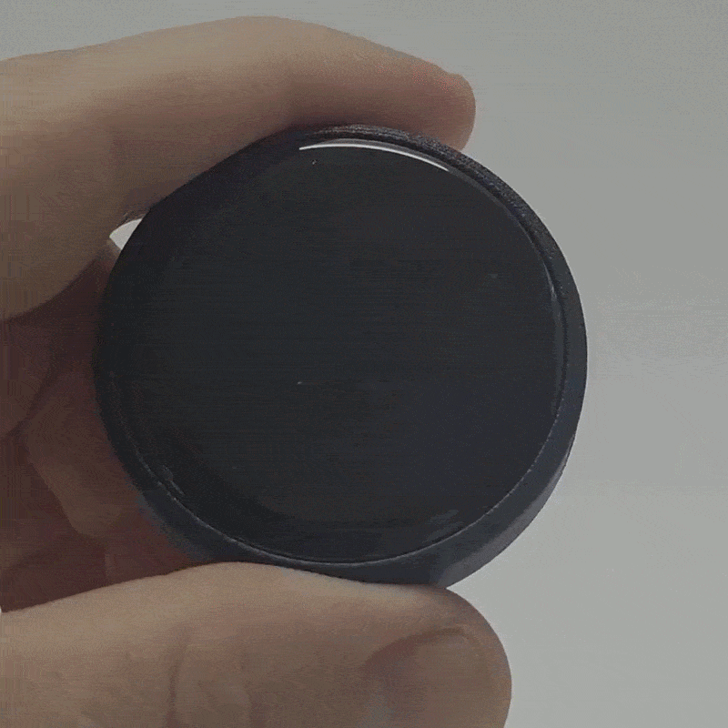

# Ks32 - Klipper Screen on the ESP32



### A simple and inexpensive way to control Klipper via Wi-Fi, using a development module that already includes an ESP32 and a touchscreen.

With KS32, you can interact with your printer from anywhere, as the connection runs over your Wi-Fi network. 

It offers nearly the same functionality as KlipperScreen, albeit with some limitations due to the small display. 

The idea was to monitor multiple printers simultaneously from my desk without having to keep numerous browser tabs open.

I designed the shell to be flexible use, allowing for various applications by incorporating an M3 insert and five magnets on the back.

## Components:

-  [ESP32 + Touch Display 1-2" DevBoard](https://s.click.aliexpress.com/e/_c38n5qfn) 
-  [Magnets cube 5x5 mm](https://s.click.aliexpress.com/e/_c37UIlXx) 
-  [Inserts M3 5x5.5 mm](https://s.click.aliexpress.com/e/_c3rIvPmt) 
-  3D Printer


## Softwares
- [Microsoft Visula Studio Code](https://code.visualstudio.com/)

## Configuration

1. Download Firmware folder
2. Install VsCode
3. Open VsCode and use shortcut (Ctrl+Shift+X)
4. Search and install PlatformIO IDE Plugin
5. When install a plugin, click on the wasp icon on the left side bar
6. Click OPEN to botton PIO HOME collapse list
7. Click on the "Open Project" button and select a Firmware folder that you downloaded previously
8. Open the config.h file in the include directory.
9. If you use the board i recommended, you simply need to enter your Wi-Fi details (SSID and password) and the printer's address [Moonraker_Host] (ex. 192.168.1.10)
10. Now we build a firmware, use a Shotcut (Ctrl+Alt+B)
11. If everything went successfully, connect the board to the PC via USB and proceed with the upload. shortcut (Ctrl+Alt+U)


```bash
// ==========================================
// WI-FI CONFIGURATION
// ==========================================
const char* const WIFI_SSID = "YOUR_WIFI_NAME";
const char* const WIFI_PASS = "YOUR_PASSword_WIFI";

// ==========================================
// MOONRAKER CONFIGURATION (KLIPPER)
// ==========================================
// Enter your Printer IP address
const char* const MOONRAKER_HOST = "192.168.1.10";
const uint16_t MOONRAKER_PORT = 7125;
```

In the `config.h` file, you can also change the function G-Code callbacks, Speed, Macro (M1, M2, M3), and more

```bash
// ==========================================
// PRINTER / G-CODE PARAMETERS
// ==========================================
// Extrusion/retraction amount (in mm)
#define EXTRUDE_MM 10
#define RETRACT_MM 10
#define EXTRUDE_FEEDRATE 300 // mm/min

// Jog movement step for X, Y, Z axes (in mm)
#define JOG_STEP_XY 10
#define JOG_STEP_Z  5
#define JOG_FEEDRATE_XY 3000 // mm/min
#define JOG_FEEDRATE_Z  600  // mm/min

// Light G-code macro or command (customizable according to your printer.cfg)
// If you use a Klipper macro named TOGGLE_LIGHT or SET_PIN PIN=caselight:
#define GCODE_LIGHT_ON  "SET_LED LED=chamber_led WHITE=1.00 SYNC=0 TRANSMIT=1"
#define GCODE_LIGHT_OFF "SET_LED LED=chamber_led WHITE=0.00 SYNC=0 TRANSMIT=1"

// Calibration commands and sensors
#define GCODE_BED_LEVEL       "BED_MESH_CALIBRATE"
#define GCODE_RESONANCE       "SHAPER_CALIBRATE"
#define FILAMENT_SENSOR_NAME  "runout_sensor"

// Customizable macros (3 buttons in the Accessories subpage)
#define GCODE_MACRO_1  "MACRO_1"
#define GCODE_MACRO_2  "MACRO_2"
#define GCODE_MACRO_3  "MACRO_3"
```
For experts wishing to use a different DevKit, I have included some useful parameters to make things easier for you.

```bash
// =============================================================================
// 1. BOARD / MCU SELECTION (ESP32)
// =============================================================================
// Select the board/ESP32 type by uncommenting the one in use.
// This setting serves as a reference for predefined pinouts.
#define BOARD_ESP32_C3_DEVKIT       // ESP32-C3 DevKitM-1 (Current default)
// #define BOARD_ESP32_STANDARD     // ESP32 WROOM / DevKit V1 (30 or 38 pins)
// #define BOARD_ESP32_S3           // ESP32-S3 DevKit
// #define BOARD_CUSTOM             // Custom board

// =============================================================================
// 2. DISPLAY CONTROLLER CONFIGURATION (TFT)
// =============================================================================
// Display controller model used:
// (Enable the corresponding driver for TFT_eSPI or GFX)
#define DISPLAY_CONTROLLER_GC9A01    // 1.28" Round Display (240x240)
// #define DISPLAY_CONTROLLER_ST7789 // 1.3" / 1.54" / 2.0" IPS Display
// #define DISPLAY_CONTROLLER_ILI9341// 2.4" / 2.8" / 3.2" Display (320x240)
// #define DISPLAY_CONTROLLER_ST7735 // 1.8" Display (128x160)
```
It will also be possible to change the GPIO values ​​for the display and touch controllers in the config.h

### You’ll also find a short video of the assembly on my social media

# Social

- [Instagram](https://www.instagram.com/sedimenti_/)
- [YouTube](https://www.youtube.com/channel/UCHJ_528ZI0BcSU-QA8kIJlg)
- [PrusaPrinter](https://www.printables.com/@SEDIMENTI_218145)
- [TikTok](https://www.tiktok.com/@sedimenti)

# Buy me a coffee

This project is Free so if you have the pleasure of supporting my next works I will be grateful fot the coffee.  
[PayPal](https://www.paypal.me/MattiaRusso308?locale.x=it_IT)
